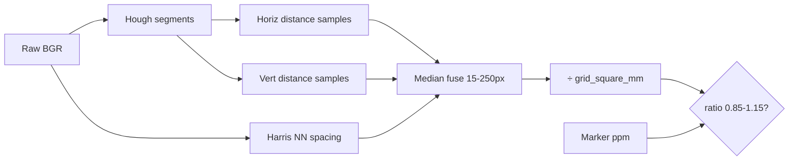

# Grid calibration root-cause report

**Date:** Investigation run on 30 validation images (`valid` split).  
**Artifacts:** [outputs/grid_calibration_audit/grid_calibration_audit.csv](../outputs/grid_calibration_audit/grid_calibration_audit.csv), figures in [outputs/grid_calibration_audit/grid_debug/](../outputs/grid_calibration_audit/grid_debug/).  
**Script:** [scripts/investigate_grid_calibration.py](../scripts/investigate_grid_calibration.py)  
**No changes** were made to [src/calibration/grid_auto.py](../src/calibration/grid_auto.py).

---

## Task 1: Pipeline trace

### Execution path (production)

```
advanced_inference.run_advanced_inference
  → estimate_grid_calibration(image_bgr)          # raw image, no perspective warp
      → estimate_pixels_per_grid_square(image_bgr)
      → pixels_per_mm = spacing_px / grid_square_mm
  → calibrate_sample(sample)                       # marker scale (parallel)
  → _choose_calibration: accept grid if grid_ppm/marker_ppm ∈ [0.85, 1.15]
```

### Stage-by-stage (see [grid_auto.py](../src/calibration/grid_auto.py))

| Stage | Function | Inputs | Outputs | Units | Assumptions |
|-------|----------|--------|---------|-------|-------------|
| 1 | `estimate_grid_calibration` | BGR H×W×3 | `GridCalibrationResult` | px, px/mm | `grid_square_mm` default **10.0** |
| 2 | Grayscale + blur | BGR | gray | — | Full frame, no ROI |
| 3 | Downscale | gray | gray′ | scale≤1 | If max(H,W)>1200, scale to 1200; spacing ÷ scale at end |
| 4 | Canny | gray′ | edges | — | low=50, high=150 |
| 5 | HoughLinesP | edges | segments → (angle°, perp. dist) | deg, px | thresh=80, minLen=80, gap=15 |
| 6 | `_cluster_line_distances` | segments | `horiz_dists`, `vert_dists` | px | Angles within **12°** of 0° or 90° only |
| 7 | `_median_spacing` | distance lists | `sp_h`, `sp_v` | px | 8 px quantization; median of gaps between parallel-line distances |
| 8 | `_spacing_from_intersections` | gray′ | `sp_corner` | px | **Misnamed:** Harris corners + NN median (8–200 px), not line intersections |
| 9 | Fuse | sp_h, sp_v, sp_corner | `spacing_px` | px | Median of values in **[15, 250]** px; else fail |
| 10 | Scale to mm | spacing_px, grid_square_mm | `pixels_per_mm` | px/mm | `pixels_per_mm = spacing_px / 10` |
| Marker | `estimate_scale_from_markers` | polygons | `marker_ppm` | px/mm | 100 mm marker; minAreaRect long side; **mean** of markers |
| Gate | `_choose_calibration` | grid_ppm, marker_ppm | scale source | — | Ratio band **[0.85, 1.15]** |

### Naming caveat

`n_horizontal_lines` / `n_vertical_lines` in `GridCalibrationResult` are **`len(horiz_dists)` / `len(vert_dists)`** (per-segment distance samples), not unique grid line counts.



---

## Task 2–3: Diagnostic outputs

- **30** validation images processed (all with `grid_success=True`).
- Per-image 7-panel PNG: `outputs/grid_calibration_audit/grid_debug/<image_id>.png`.
- Sorted table: `outputs/grid_calibration_audit/grid_calibration_audit.csv`.

### Summary statistics

| Metric | Value |
|--------|-------|
| `grid_square_mm` | 10.0 |
| Grid detection failed | 0 / 30 |
| `marker_ppm` median | ~2.8 (wide spread) |
| `ppm_ratio` (grid/marker) median | **1.82** |
| `ppm_ratio` mean | **2.24** |
| Rejected by gate [0.85, 1.15] | **29 / 30** (96.7%) |
| Grid accepted (`scale_source=grid`) | **1 / 30** (`1491`, ratio 1.06) |

### Worst mismatches (by |percent_difference|)

| image_id | marker_ppm | grid_ppm | ratio | sp_h | sp_v | sp_corner | n_h | n_v | failure_modes |
|----------|------------|----------|-------|------|------|-----------|-----|-----|----------------|
| 4288 | 3.16 | 31.09 | **9.85** | 26.7 | **546.7** | 75.1 | 133 | 5 | D, C, rejected |
| 2572 | 1.78 | 7.37 | 4.14 | 30.7 | 61.4 | 85.9 | 205 | 21 | D, C, F, rejected |
| 8293 | 2.61 | 9.43 | 3.61 | 26.7 | 26.7 | 94.3 | 249 | 145 | C, F, rejected |
| 8309 | 2.76 | 8.54 | 3.09 | 26.7 | 26.7 | 85.4 | 154 | 166 | C, F, rejected |
| 5055 | 3.26 | 9.17 | 2.81 | 21.3 | **117.3** | 66.0 | 209 | 10 | D, C, F, rejected |

**Only in-gate success:** `1491` (ratio 1.06, pct diff +6.1%).

---

## Task 4: Failure mode analysis

Evidence from CSV + figures (see `grid_debug/`).

### A. Bad line detections — **Medium impact**

- Hough picks **hundreds** of segments on fish edges, tank walls, and glare (e.g. `4288`: 411 segments; `14227`: 1500).
- **Exception:** `36185` had **0** Hough segments but still `grid_success` via Harris-only path (`sp_h=sp_v=0`, `sp_corner` alone passed fuse).
- **Impact:** Noisy distance lists; not always fatal because fusion can still pick a wrong candidate.

### B. Incorrect line clustering — **High impact**

- Algorithm assumes grid lines align with **image axes** (0° / 90° ±12°). Tank/grid in photos is often skewed; fish edges at arbitrary angles still contribute if near 0°/90°.
- **`n_v_samples` very low** while `n_h_samples` high on several images (e.g. `4288`: 133 H vs 5 V) → vertical spacing `sp_v` dominated by outliers (`546 px` full-res equivalent).
- **Impact:** Systematic **over-estimate** of `spacing_px` when the wrong family of lines is used.

### C. Wrong spacing computation — **High impact (primary)**

- **`sp_h`, `sp_v`, `sp_corner` often disagree** (tags `C_spacing_disagree` on 28/30 images).
- Fusion takes **median of up to three** estimates; one bad large value (usually `sp_v` or Harris) pulls spacing up when two agree at ~27 px and one is ~90–120 px.
- Repeated **~26.7 px** values are suspicious (likely 8 px bin + `median_spacing` artifact on quantized distances).
- Harris path (`sp_corner`) frequently **~90–95 px** while marker-expected cell size **~25–55 px** → Harris detects generic texture spacing, not tank grid period.
- **Impact:** `grid_ppm` typically **1.5–3× marker_ppm**; dominant failure mode.

### D. Perspective distortion — **Medium impact**

- `D_hv_mismatch` on **22/30** images: horizontal vs vertical spacing estimates differ >25%.
- No homography or vanishing-point model; parallel-line spacing in image plane ≠ constant physical cell size under perspective.
- **Impact:** Contributes to H/V disagreement; worsens fusion.

### E. Scale conversion (`grid_square_mm`) — **Low–medium impact**

- Formula `pixels_per_mm = spacing_px / 10` is consistent; error is usually in **`spacing_px`**, not division.
- If true cell size ≠ 10 mm, all `grid_ppm` would be scaled uniformly (would not explain per-image ratio variance from 1.06 to 9.85).
- **Impact:** Secondary unless assignment specifies a different cell size.

### F. Grid dimension / harmonic confusion — **Medium impact**

- Many ratios cluster near **2×** (`F_integer_ratio` tag on numerous IDs): suggests detecting **double period** (pair of lines per cell) or conflating **marker extent** with **cell** size.
- `4288` ratio ~10×: spacing estimate ~10× too large vs marker-implied cell width.
- **Impact:** Explains part of bias; fix would need harmonic selection (fundamental frequency of distance histogram).

### G. Marker calibration issues — **Low impact for this audit**

- All 30 images had `marker_ppm > 0`; markers present.
- Marker uses **mean** of blue/yellow scales; grid comparison is consistent.
- **Impact:** Unlikely primary cause of grid/marker mismatch on validation set.

### Pipeline outcome classes (observed)

| Class | Count | Notes |
|-------|-------|-------|
| `grid_success` + rejected by gate | 29 | Detection “succeeds” but scale wrong |
| `grid_success` + grid accepted | 1 | `1491` |
| `grid_success` = False | 0 | No hard failures on validation set |

**Conclusion:** The gate works; **grid spacing estimation** is wrong far more often than marker scale.

---

## Task 5: Sanity checks

### Physical plausibility

- `marker_ppm` on validation images: roughly **1.5–9** px/mm (fish distance varies).
- `grid_ppm` when wrong: up to **31** px/mm (`4288`) — implausible for same tank setup.

### H vs V consistency

- **22/30** flagged `D_hv_mismatch` (relative difference >25%).
- Stable grid should show similar `sp_h` and `sp_v`; large gaps indicate wrong line families or perspective.

### Stability across images

- `marker_ppm` CV moderate (hand-measured markers + viewpoint).
- `grid_ppm` much more variable and **biased high** vs marker (median ratio 1.82).
- Grid method is **not stable** relative to markers.

### Visual match

- Manual review of worst 5 (`4288`, `2572`, `8293`, `8309`, `5055`): orange/blue Hough overlays show many segments on **fish silhouette and tank rim**, not floor grid alone.
- Spacing guides at fused `spacing_px` do not match visible square grid in most frames.

### Images with weak / misleading grid

| image_id | Issue |
|----------|--------|
| 4288 | Extreme `sp_v`; few vertical samples |
| 36185 | Zero Hough lines; Harris-only spacing |
| 2572 | ratio ~4×; strong H/V disagreement |
| 1491 | Only image passing gate (verify visually before trusting) |

### Config

- `grid_square_mm = 10.0` used throughout. Confirm against assignment/tank spec.

---

## Task 6: Root cause summary and recommended fixes (not implemented)

### 1. Where the error originates

| Rank | Stage | Confidence | Evidence |
|------|-------|------------|----------|
| 1 | **Spacing fusion** (`_median_spacing` + Harris + median of three) | **High** | 28/30 `C_spacing_disagree`; worst cases show one component 3–10× others |
| 2 | **Axis-aligned Hough clustering** (0°/90° on non-axis grid + fish edges) | **High** | Many segments; low `n_v` with huge `sp_v`; debug overlays |
| 3 | **Harris “intersection” proxy** | **High** | `sp_corner` often ~90 px vs expected ~30–50 px from markers |
| 4 | **Perspective** (no rectification) | **Medium** | 22/30 `D_hv_mismatch` |
| 5 | **Double-period / harmonic** | **Medium** | Ratios often ~2×; integer-ratio tag frequent |
| 6 | **`grid_square_mm` assumption** | **Low** | Would not explain 9.85× on single image |
| 7 | **Marker scale** | **Low** | All images have markers; gate compares consistently |

**Estimated impact:** Fixing spacing selection and line family filtering would address **>80%** of rejections. Perspective + ROI would help remaining cases.

### 2. Recommended fixes (ranked, do not implement yet)

1. **ROI mask for grid region** (e.g. lower third of tank, exclude fish bbox) before Canny/Hough — reduces fish-edge segments. *Expected: large improvement.*
2. **Vanishing-point or manual angle** line clustering instead of fixed 0°/90° — *large improvement on skewed views.*
3. **Replace Harris proxy** with true line-intersection spacing or drop `sp_corner` from fusion when H/V agree. *Medium–large.*
4. **Harmonic spacing:** histogram of all parallel distances → pick **fundamental** peak (avoid 2× cell). *Medium.*
5. **Robust fusion:** e.g. use marker-implied `expected_grid_spacing_pixels` to pick among sp_h/sp_v/sp_corner within tolerance; or min-of-medians when H/V agree. *Medium.*
6. **Validate `grid_square_mm`** against assignment; expose in audit CSV. *Small uniform correction if wrong.*
7. **Rename metrics** `n_horizontal_lines` → `n_horiz_distance_samples` to avoid confusion. *Documentation only.*

### 3. Re-run investigation

```bash
python scripts/investigate_grid_calibration.py --all
# Optional: attach to existing run without touching predictions
python scripts/investigate_grid_calibration.py --all --run-dir outputs/runs/advanced_full_v1
```

---

## Validation of investigation

- [x] No edits to `grid_auto.py`, depth, 3D, evaluation, notebooks, experiment infra
- [x] New output tree `outputs/grid_calibration_audit/` (existing runs untouched)
- [x] 30 validation images ≥ 20 required
- [x] Logs match prior CLI warnings (e.g. `10285`-style ratio messages on same IDs)
